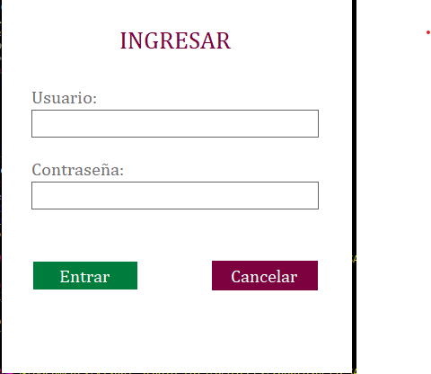
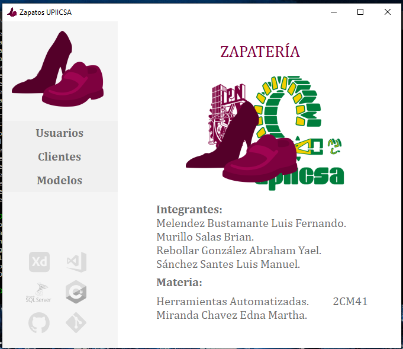
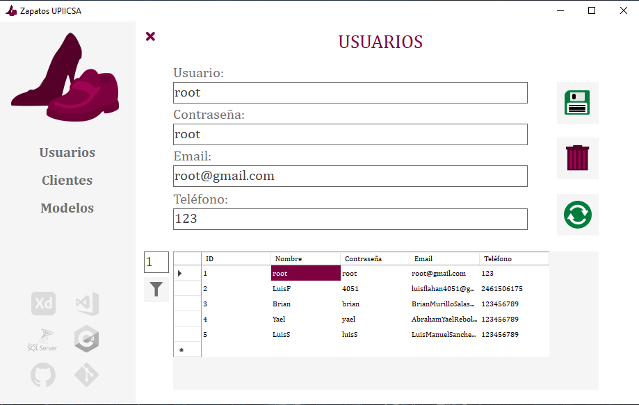
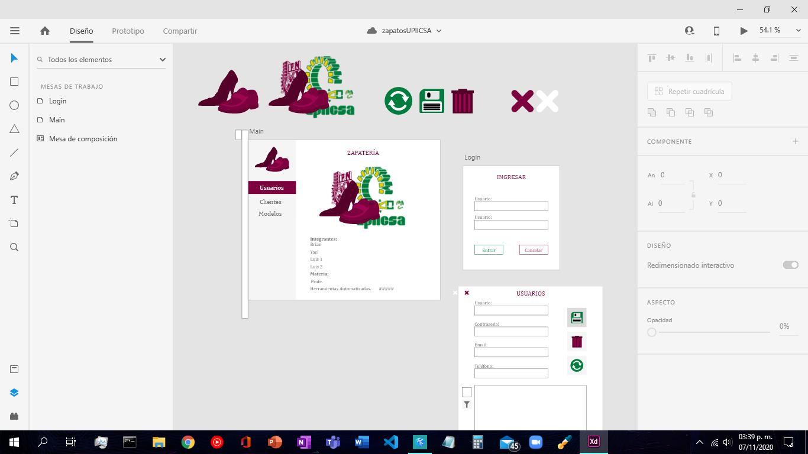
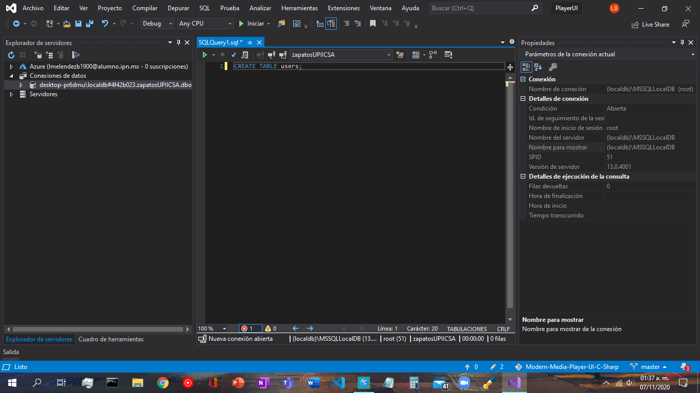

# Zapatos UPIICSA Simple registradora

Proyecto escolar del instituto:
IPN - UPIICSA

Profesor: 
Miranda Chavez Edna Martha

## Capturas

## Tecnologías usadas 🛠️

Lenguaje de programación **C#**

Interfaz GUI **.Net**

Base de Datos **SQLServer Azure**

ID **VS Studio 2019**

### Pre-requisitos de compilación 📋

SQLServer

### Instalación 🔧

Instalador MSI:

## Autores ✒️
Secuencia: **2CM41**

**Melendez Bustamante Luis Fernando.**
2020602568
https://github.com/luisflahan4051

**Murillo Salas Brian.**
--
https://github.com/Brian-54

**Rebollar González Abraham Yael.**
**Sánchez Santes Luis Manuel.**
--
--

## Licencia 📄

Fue contruído VS Studio for Students en Windows 10.